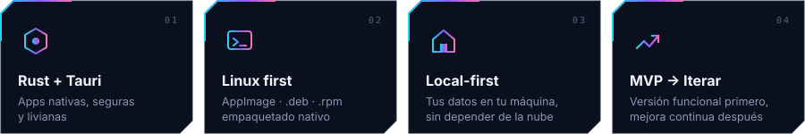

   

  

 

Desarrollador Full Stack con formación técnica en electrónica, diagnóstico, mantenimiento y soporte. Llevé esa experiencia práctica al software: herramientas internas, paneles administrativos, utilidades de escritorio, automatizaciones y aplicaciones web. Priorizo soluciones **claras, mantenibles y orientadas a resolver problemas reales**.

  

 

| | |
|:---:|:---|
| **Lenguajes** |  |
| **Frontend** |  |
| **Backend** |  |
| **Datos** |  |
| **Escritorio** |  |
| **Infra** |  |

 

 

| | Área | Alcance |
|:---:|---|---|
| ⚡ | **Backend y APIs** | Servicios REST, lógica de negocio, arquitectura server-side |
| 🐧 | **Apps de escritorio** | Rust + Tauri para Linux (AppImage, .deb, .rpm) · Electron, Python y C# para herramientas internas |
| ⚙️ | **Automatización** | Scripts y procesos que eliminan trabajo operativo repetitivo |
| 🏢 | **Software de negocio** | Sistemas administrativos, paneles internos, modelado de datos |
| 🧠 | **IA aplicada** | Asistentes y flujos con modelos locales (Ollama) |

 

 

Más proyectos por categoría

 

| Categoría | Proyectos |
|---|---|
| Herramientas de desarrollo | [Aurelius-Agent](https://github.com/MatiasFrutos/Aurelius-Agent) · [stackforge](https://github.com/MatiasFrutos/stackforge) · [DevProject-Starter-Generator](https://github.com/MatiasFrutos/DevProject-Starter-Generator) · [Configlens](https://github.com/MatiasFrutos/Configlens) · [visual-logic](https://github.com/MatiasFrutos/visual-logic) |
| Datos y automatización | [SheetPilot](https://github.com/MatiasFrutos/SheetPilot) · [DataCleaner-Pro](https://github.com/MatiasFrutos/DataCleaner-Pro) · [Heraclitus-Trace](https://github.com/MatiasFrutos/Heraclitus-Trace) |
| Archivos y red | [Hermes-Drop](https://github.com/MatiasFrutos/Hermes-Drop) · [ZERNYX-Network-Scanner](https://github.com/MatiasFrutos/ZERNYX-Network-Scanner) · [ZERNYX-Service-Checker](https://github.com/MatiasFrutos/ZERNYX-Service-Checker) |
| Sistemas y mantenimiento | [ZERNYX-Backup-Guardian](https://github.com/MatiasFrutos/ZERNYX-Backup-Guardian) · [ZERNYX-Log-Inspector](https://github.com/MatiasFrutos/ZERNYX-Log-Inspector) · [ZERNYX-File-Organizer](https://github.com/MatiasFrutos/ZERNYX-File-Organizer) · [ZERNYX-Maintenance-Planner](https://github.com/MatiasFrutos/ZERNYX-Maintenance-Planner) · [ZERNYX-App-Installer](https://github.com/MatiasFrutos/ZERNYX-App-Installer) |
| Utilidades de escritorio | [ZERNYX-Quick-Notes](https://github.com/MatiasFrutos/ZERNYX-Quick-Notes) · [ZERNYX-Password-Generator](https://github.com/MatiasFrutos/ZERNYX-Password-Generator) · [ZERNYX-Advanced-Calculator](https://github.com/MatiasFrutos/ZERNYX-Advanced-Calculator) · [ZERNYX-Geo-Agenda](https://github.com/MatiasFrutos/ZERNYX-Geo-Agenda) |

 

<picture>
  <source media="(prefers-color-scheme: dark)" srcset="https://raw.githubusercontent.com/MatiasFrutos/MatiasFrutos/output/github-snake-dark.svg">
  <source media="(prefers-color-scheme: light)" srcset="https://raw.githubusercontent.com/MatiasFrutos/MatiasFrutos/output/github-snake.svg">
  
</picture>

 

**Disponible para:** apps de escritorio para Linux · backends y APIs con Node.js y PostgreSQL · automatización e IA local · open source

 

   

  

<i>"No espero tener todo perfecto para empezar. Prefiero construir, aprender, corregir y seguir avanzando."</i>

